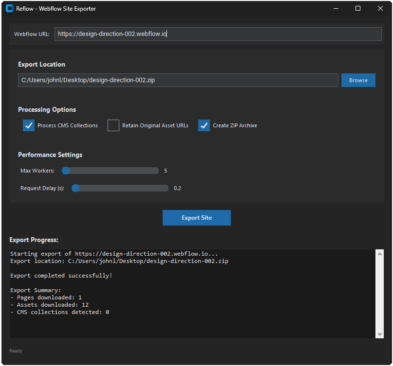

# Reflow

Downloads Webflow sites to static HTML, preserving structure and styling.



Download the latest release from: https://github.com/johnlindquist/Reflow/releases

**Note:** When opening the exported HTML files locally, you may encounter CORS issues. To view the site properly, you can disable CORS in your browser or serve the files using a local server (e.g., `python -m http.server`).

Install:
```
pip install -r requirements.txt
```

Run:
```
python reflow_gui.py
```

Command line options also available:
```
python reflow.py https://your-site.webflow.io
--output, -o: Output directory/zip file (default: output)
--workers, -w: Number of download workers (default: 5)
--delay, -d: Delay between requests (default: 0.2s)
--no-cms: Skip CMS collections
--no-css: Keep original asset URLs
--no-zip: Export as directory instead of ZIP
--verbose, -v: Show debug logs
--quiet, -q: Show only errors
--log-file: Save logs to file 